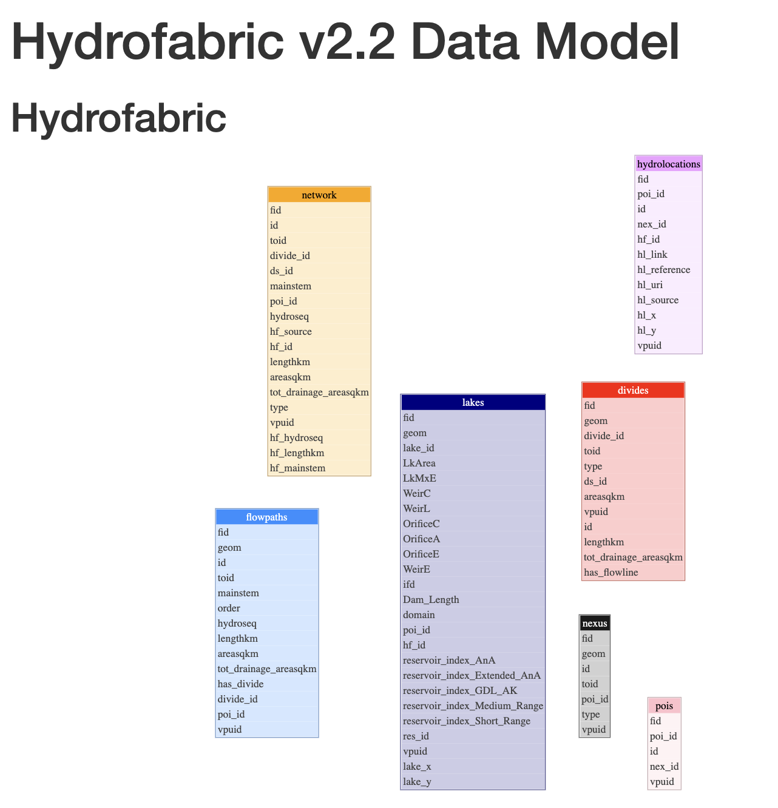

# Hydrofabric

### Catalog information

The hydrofabric is a unique case where there are many namespaces containing the same tables/layer layouts. This is to model the version 2.2 Hydrofabric dataset.

<figure markdown="span">
  { width="600" }
  <figcaption>The Hydrofabric v2.2 Data Model. Credit to Lynker Spatial: https://lynker-spatial.s3-us-west-2.amazonaws.com/hydrofabric/v2.2/hfv2.2-data_model.html</figcaption>
</figure>

#### Namespaces

The following namespaces make up the Full Hydrofabric Dataset

- `conus_hf`
  - The CONUS Domain
- `ak_hf`
  - The Alaskan Domain
- `hi_hf`
  - The Hawaii Domain
- `prvi_hf`
  - The Puerto Rico/Virgin Islands Domain
- `gl_hf`
  - The Great Lakes Domain
