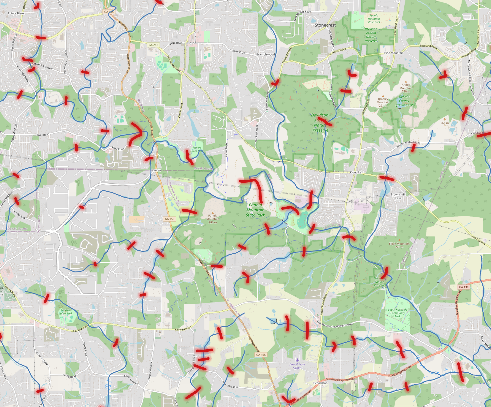

# RAS XS

### Catalog information
#### Namespace: `ras_xs`

This namespace contains HEC-RAS submodels used to create FIMs.

### Tables

#### `extracted`

These are processed HEC-RAS cross-section attributes per flowpath extracted to the Hydrofabric v3 reference. There is one representative XS per flowpath with joined metadata from hydraulic units and NHDPlus.

##### How is this file created:

0. Download the reference fabric from PyIceberg and MIP data from S3.

    The MIP data is located in the following path on the NGWPC S3 bucket: `s3://fimc-data/ripple/fim_100_domain/collections/` and can be downloaded using the following command: `aws s3 sync s3://fimc-data/ripple/fim_100_domain/collections/ . --exclude "*" --include "*.gpkg"`. Within the OE, this data has already been downloaded for local use in the following location: `/efs/edfs-data/pi_5/mip_full_collection/`.

    The v3 reference fabric has been version-controlled within the NGWPC Data Lake and can be downloaded using the following script: `python tools/hydrofabric/download_reference_fabric.py --catalog glue` if it is not on your local system.

1. Extracting the HEC-RAS `submodels`

    The `icefabric/tools/iceberg/R/fema_xs_processing.R` script processes elevation profile data from FEMA BLE submodels, extracting key cross-sectional (XS) geometry attributes for hydraulic analysis. The overall goal is to compute summary statistics and representative cross-sections per stream reach in the reference fabric, so that it can be used within the existing riverML framework for predicting channel size and shape. This work was completed by Lynker-Spatial and intergrated into the Icefabric by the Raytheon NGWPC EDFS Team.

    Inside of this function each submodel has its cross-sections (XS) read into memory and transformed into a common CRS (EPSG:5070).

    For each transect: - Parse and clean the raw string of elevation points. - Identify left/right bank extents. - Subset the relevant portion and smooth the elevation. - Filter out degenerate transects (e.g., no real depth). - Compute metrics: - Ym: channel depth - TW: top width - A: channel area - r: Dingmans R coefficient - Save it as a geometry object with selected metadata. - Also extracts metadata like the coordinate system units and stores them for each reach.

    Once the data is extracted, it's merged together where one XS is made per flowpath.

2. Exporting the geopackage to parquet

    Using the following command `python tools/ras_xs/gpkg_to_parquet.py --gpkg riverML_ripple_beta.gpkg` to write the geopackage to an arrow parquet file. The reason that this is done in python and not in the R script is geopandas has support for writing geometries to WKB, which can be ingested by Arrow/S3 Tables.

3. Writing the parquet file to the PyIceberg S3 Tables

    Using the following command `python tools/iceberg/production/build_ras_xs.py --file data/hydrofabric/riverML_ripple_beta.gpkg.parquet` write the outputted parquet file into the PyIceberg S3 Tables.

Once that's inputted, you can see the following outputs from PyIceberg:

##### Example Output:
```py
>>> load_catalog("glue").load_table("ras_xs.extracted").scan().to_pandas()
       flowpath_id         r            TW          Y  source_river_station  river_station                                              model        ftype  streamorde                                           geometry
0         10023956  1.557875     67.663333   6.398817                560.22            2.0  /Users/taddbindas/projects/NGWPC/icefabric/dat...  StreamRiver         2.0  b'\x01\x02\x00\x00\x00\x05\x00\x00\x00\xc5mkmd...
1         10023980  2.258627     31.300000   0.615000               3403.89           14.0  /Users/taddbindas/projects/NGWPC/icefabric/dat...  StreamRiver         5.0  b'\x01\x02\x00\x00\x00\x04\x00\x00\x00\x19X\xc...
2         10023986  0.923102    168.696667   5.120922                335.04            2.0  /Users/taddbindas/projects/NGWPC/icefabric/dat...   CanalDitch         2.0  b'\x01\x02\x00\x00\x00\x05\x00\x00\x00\x03VE\x...
3         10024318  1.884064    201.115000   9.884953              74820.00            1.0  /Users/taddbindas/projects/NGWPC/icefabric/dat...  StreamRiver         5.0  b'\x01\x02\x00\x00\x00\x02\x00\x00\x00\xd1!.^i...
4         10024334  2.150152    362.250000  13.597386              81856.00            6.0  /Users/taddbindas/projects/NGWPC/icefabric/dat...  StreamRiver         5.0  b'\x01\x02\x00\x00\x00\x04\x00\x00\x00<\x81\x8...
```

<figure markdown="span">
  { width="600" }
  <figcaption>Example XS (in red) mapped to the reference fabric (blue)</figcaption>
</figure>

If you would like to further understand the operations done to the HEC-RAS XS, please see the document: https://lynker-spatial.github.io/mip-riverml/#final-data-access
