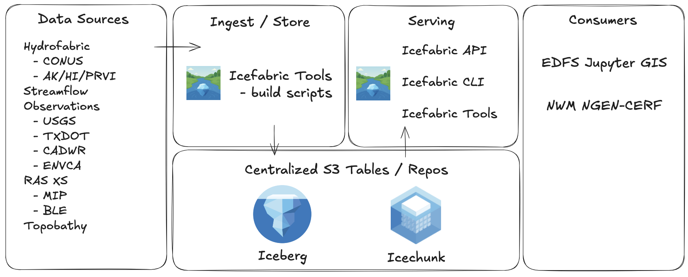

# Icefabric: Lakehouse Architecture for Hydrologic Data Management

<figure markdown="span">
  { width="600" }
  <figcaption>The icefabric lake house architecture. Data is moved from sources to an underlying specificed format (iceberg/icechunk) and queried to consumers via APIs and services.</figcaption>
</figure>

## Overview

Icefabric implements a modern **lakehouse architecture** to combine the flexibility of data lakes with the performance and governance of data warehouse. This system provides versioned, centralized access to hydrologic datasets to support the National Water Model.

## The Problem: Hydrologic Data Complexity

### Traditional Challenges

Hydrologic research and operations face unique data management challenges:

- **Heterogeneous Data Sources**: Datasets are sourced from different agencies in various formats
- **Multiple Formats**: Tabular, vectorized, COGs, etc
- **Version Control Needs**: Hydrofabric topology updates, data quality improvements, and research reproducibility

### Why Traditional Solutions Fall Short

**Traditional database systems** struggle with:

- Large geospatial datasets and complex geometries
- Schema evolution for evolving datasets
- Version control for scientific workflows

**File-based approaches** suffer from:

- Data duplication and storage inefficiencies
- Lack of ACID transactions
- Manual version management
- Limited discovery and access controls

## Lakehouse Architecture Solution

### Technology Stack Rationale

=== "Apache Iceberg - Structured Data"

    **Used For:**
    - Hydrofabric geospatial products
    - Streamflow observations time series (USGS, Local Agencies)
    - Cross-section geometries (RAS XS [MIP/BLE])

    **Why Iceberg:**
    - **ACID Transactions**: Ensure data consistency during hydrofabric updates
    - **Schema Evolution**: Handle network topology changes without breaking existing workflows
    - **Time Travel**: Access historical network versions for model comparisons
    - **Performance**: Optimized queries across continental-scale datasets
    - **Partition Pruning**: Efficient spatial and temporal filtering

=== "Icechunk - Array Data"

    **Used For:**
    - Topobathy elevation surfaces
    - Land cover classifications

    **Why Icechunk:**
    - **Virtual References**: Avoid duplicating large raster datasets
    - **Zarr Compatibility**: Seamless integration with scientific Python ecosystem
    - **Git-like Versioning**: Branch/merge workflows for experimental processing
    - **Chunked Storage**: Optimized for geospatial access patterns
    - **Compression**: Efficient storage of repetitive classification data

## Benefits Realized

### For Hydrologic Research

- **Reproducible Science**: Exact data versions enable repeatable research
- **Collaborative Workflows**: Branching enables parallel research without conflicts
- **Quality Evolution**: Track data quality improvements over time

### For Operational Forecasting

- **Consistent Baselines**: Stable data versions for operational model runs
- **Real-time Integration**: Fast access to latest observations and forecasts
- **Rollback Capabilities**: Quick recovery from data quality issues

### For Data Management

- **Access Unification**: Single API for diverse hydrologic data types
- **Version Management**: Automated tracking eliminates manual version confusion
- **Quality Assurance**: Built-in validation prevents bad data propagation

## Conclusion

The Icefabric lakehouse architecture addresses fundamental challenges in hydrologic data management through:

1. **Unified Access**: Single interface for diverse water data sources
3. **Version Control**: Git-like workflows for scientific data management
4. **Quality Assurance**: Automated validation and lineage tracking
6. **Research Support**: Reproducible environments for collaborative science

This architecture enables EDFS to provide reliable, versioned, high-performance access to critical water resources data supporting both operational forecasting and cutting-edge research.
