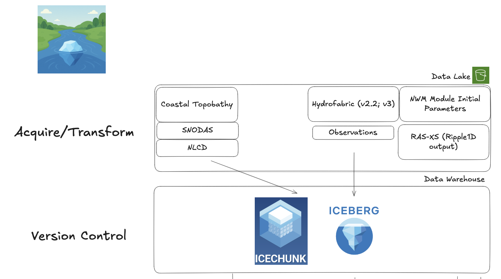

# Icefabric

## The mission

The idea for the icefabric came from the need to version control datasets for the National Water Model 4.0. There were many different file formats, and hydrofabric versions, but the need for an [Apache Iceberg](https://iceberg.apache.org/) style backend was realized. The name itself, icefabric, is a reference to this. 

Thus, this repo is a workspace for all icefabric assembly, tranformation, and dissemination. 

The repo is structured in the following workspace packages:

### Icefabric Manage
The repo for building a local version of the icefabric and updating cloud stores

### Icefabric Tools
The repo for all compute services built on the icefabric

### Icefabric API
The interface between the icefabric and outside entities
