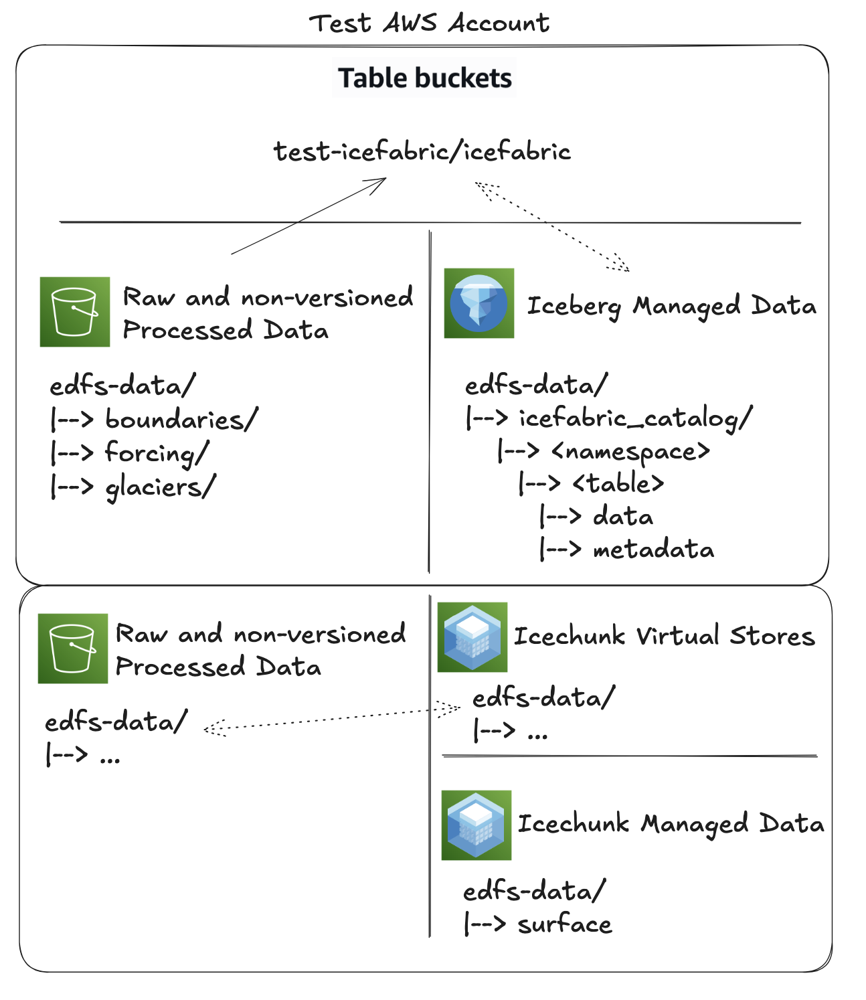

### Pushing to prod

This folder is set up to create/update production iceberg S3 Tables on the AWS test account.

To ensure that we don't accidentally override data before our code for data manipulation is accurate, the following strategy is being proposed. There will be three steps to data promotion from Dev → Test → Prod

Dev
Pyiceberg namespaces and tables can both exist in a centralized location and a local directory on a user's system. Through using the `export_catalog.py` script, a namespace can be locally created in the /tmp  directory using SQLlite/DuckDB. Since these local tables are detached from the production data lake, the code/data is safe for all development/manipulation

Test
Once code is vetted and merged into Github, tests of code services be done locally through read-only queries of the production glue catalog. These can be done through changing the catalog name from sql  to glue .

Prod
After code passes test, we can begin to update the Production glue catalog with any data that was manipulated by the code. The S3 table will be updated, with the new snapshot noted with the specific delivery. Any snapshots which require additional backups will be downloaded into the edfs-data/ into a folder specified by the snapshot ID.


When writing update scripts, it's important to know the location of the data that you're writing to. Uploading data to S3 Tables tracks the file location, which all should live on the Test account.



### Example workflow
For this workflow I'll be showing how to update the CONUS hydrofabric namespace

#### Build/Create
*Note* this assumes you have a .gpkg file that you'd like to upload to PyIceberg
1. Write the geopackage to a parquet
```sh
python tools/hydrofabric/gpkg_to_parquet.py --gpkg conus_hf.gpkg --output-folder /tmp/hf
```

2. Build a local warehouse for testing using the sql warehouse
```sh
python tools/iceberg/build_hydrofabric.py --catalog sql --files /tmp/hf --domain conus
```

3. Test that this is working, confirm with a team member in peer review

4. Update the GLUE endpoint
```sh
python tools/iceberg/build_hydrofabric.py --catalog glue --files /tmp/hf --domain conus
```

#### Update
1. Export the table you are looking to update from the S3 Tables so you have a local dev warehouse
```sh
python tools/iceberg/export_catalog.py --namespace conus_hf
```

2. Download the gpkg so you can make changes
```sh
python tools/hydrofabric/download_hydrofabric_gpkg.py --namespace conus_hf
```

3. Make changes to the geopackage

4. Write the geopackage to a parquet
```sh
python tools/hydrofabric/gpkg_to_parquet.py --gpkg patch_conus_hf.gpkg --output-folder /tmp/hf
```

5. Update the local warehouse table
```sh
python tools/iceberg/update_hydrofabric.py --layer <LAYER> --file </tmp/hf/FILE TO BE UPDATED> --domain conus
```

6. Once the data is updated and works, confirm with a team member that the data is correct, then prod can be updated
```sh
python tools/iceberg/update_hydrofabric.py --catalog glue --layer <LAYER> --file </tmp/hf/FILE TO BE UPDATED> --domain conus
```
